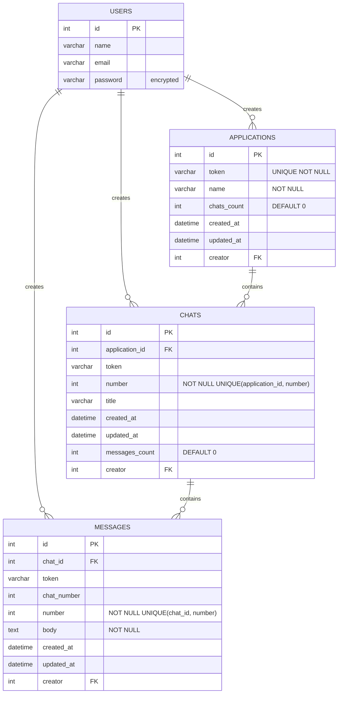

<h2 align="center"> Description </h2>

---
<h2 align="center"> Installation </h2>

---
<h2 align="center"> API Docs </h2>

---
<h2 align="center"> Functional requirements </h2>

1. create/update/read application (generated token + name)
1. create/read chats (identity starting from 1 for each application, number should be returned on creation) (async) ( go ) linked with the application by token `GET /applications/[application_token]/chats`
1. create/update/read messages (identity starting from 1 for each chat, number should be returned on creation) (async) ( go ) linked with the chat number, application by token
1. DONOT RETURN ANY ID TO THE CLIENT
1. full text search per chat (elastic search)
1. applications table should have (chats_count) (eventual consistency)
1. chats table should have (messages_count) (eventual consistency)
1. multiple servers (concurrency / race conditions)
1. appropriate indices
1. mysql / docker-compose / rabbitmq / redis / ruby / backend only / REST / readme / tests

---
<h2 align="center"> Non functional requirements </h2>

1. available & eventually consistent
1. high reads:write ratio

---
<h2 align="center"> High Level Design </h2>


---
<h2 align="center"> Requests Service </h2>

**Auth:** Basic Auth + JWT

### 🟢 Applications

| Method | Route | Request | Status | Response |
|--------|--------|----------|---------|-----------|
| **POST** | `/applications` | ```json { "name": "string" } ``` | `200` | ```json { "token": "string" } ``` |
| **PUT** | `/applications` | ```json { "token": "string", "name": "string" } ``` | `200 / 403 / 404` | — |
| **GET** | `/applications` | — | `200` | ```json [ { "token": "string", "name": "string", "chatsCount": "number" } ] ``` |

### 🟣 Chats

| Method | Route | Request | Status | Response |
|--------|--------|----------|---------|-----------|
| **POST** | `/applications/<token>/chats` | — | `200 / 404` | ```json { "chatNumber": "number" } ``` |
| **GET** | `/applications/<token>/chats` | — | `200 / 404` | ```json [ { "chatNumber": "number", "messagesCount": "number" } ] ``` |

### 🔵 Messages

| Method | Route | Request | Status | Response |
|--------|--------|----------|---------|-----------|
| **POST** | `/applications/<token>/chats/<chatNumber>/messages` | ```json { "body": "string", "createdAt": "datetime" } ``` | `200 / 404` | ```json { "messageNumber": "number" } ``` |
| **PUT** | `/applications/<token>/chats/<chatNumber>/messages` | ```json { "messageNumber": "number", "body": "string" } ``` | `200 / 403 / 404` | — |
| **GET** | `/applications/<token>/chats/<chatNumber>/messages?page=1&limit=10` | — | `200 / 404` | ```json [ { "messageNumber": "number", "senderName": "string", "body": "string", "createdAt" "datetime" } ]```<br>_ordered desc by creation date_ |
| **GET** | `/applications/<token>/chats/<chatNumber>/messages/search?q=string` | — | `200 / 404` | ```json [ { "messageNumber": "number", "body": "string", "createdAt": "datetime" } ]``` |

---
<h2 align="center"> Writer Service </h2>

### 📨 Create Messages Consumer

**Request**
```json
{
  "token": "string",
  "chatNumber": "number",
  "messageNumber": "number",
  "senderId": "number",
  "body": "string",
  "date": "datetime"
}
```

**Action**
- Create a new message in the database  
- Push to Elastic

### ✏️ Update Messages Consumer

**Request**
```json
{
  "token": "string",
  "chatNumber": "number",
  "messageNumber": "number",
  "body": "string"
}
```

**Action**
- Update the message in the database  
- Push to Elastic  
- Invalidate cache

### 💬 Create Chats Consumer

**Request**
```json
{
  "token": "string",
  "chatNumber": "number",
  "creatorId": "number"
}
```

**Action**
- Create a new chat in the database

### ⏱️ Cron Job (every N minutes)

- Read from Redis keys  
- Update chats count in **applications**  
- Update messages count in **chats**

---
<h2 align="center"> Redis </h2>

| Description | Key | Value |
|--------|--------|----------|
|chat counter|`<token>`|number|
|message counter|`<token>:<charNumber>`|number|

---
<h2 align="center"> Database </h2>

***Denormalized to reduce joins***



### Indices
| Table | Columns | Type | Clustered | Primary |
|--------|--------|--------|--------|--------|
|Chats|`token`|B-Tree| false | false |
|Messages|`<token>:<charNumber>`|B-Tree| false | false |
