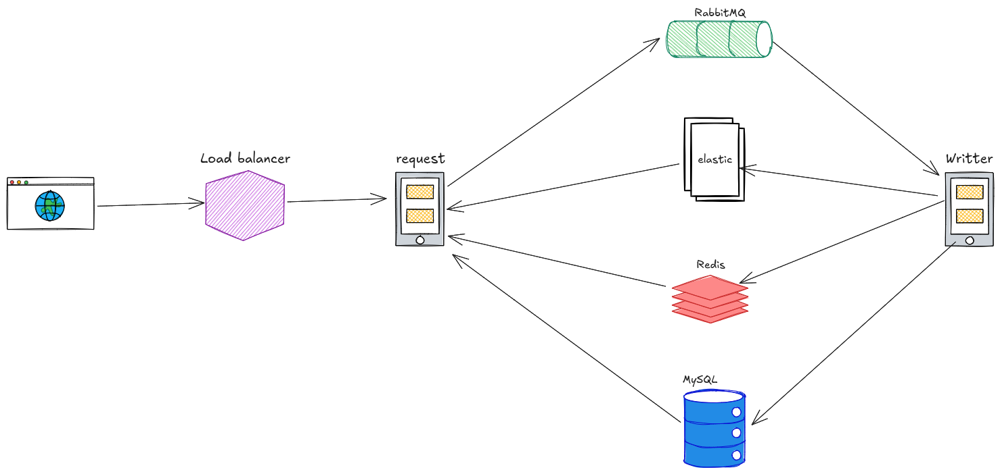
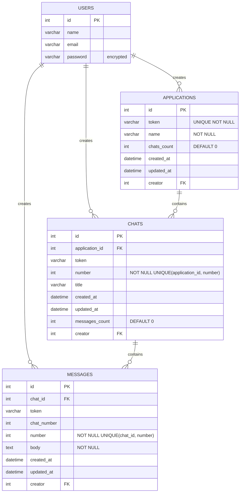

<h2 align="center"> Description </h2>

A distributed chat application system built with Ruby on Rails (API service) and Go (async worker service). The system provides RESTful APIs for managing applications, chats, and messages with full-text search capabilities using Elasticsearch. Designed for high availability and eventual consistency with asynchronous message processing.

**Key Technologies:**
- **Backend API**: Ruby on Rails 7
- **Worker Service**: Go
- **Database**: MySQL 8.0
- **Cache & Counters**: Redis 7
- **Message Queue**: RabbitMQ 3
- **Search Engine**: Elasticsearch 8.11

---
<h2 align="center"> Installation </h2>

### Prerequisites

- Docker & Docker Compose
- Git

### Quick Start

1. **Clone the repository:**
```bash
git clone https://github.com/Mohamed-Fathy-Salah/Chat.git
cd chat
```

2. **Start all services:**
```bash
docker-compose up -d
```

This will start:
- MySQL database (port 3306)
- Redis (port 6379)
- RabbitMQ (port 5672, management UI: 15672)
- Elasticsearch (port 9200)
- Requests API service (port 3000)
- Writer worker service

**Note:** JWT secret key is automatically generated and persisted on first run.

3. **Verify services are running:**
```bash
docker-compose ps
```

4. **View logs:**
```bash
docker-compose logs -f
```

5. **Access the API:**
```
Base URL: http://localhost:3000/api/v1
Swagger API Docs: http://localhost:3000/api-docs/index.html
RabbitMQ Management: http://localhost:15672 (guest/guest)
Elasticsearch: http://localhost:9200
```

### JWT Key Rotation

To rotate the JWT secret key (recommended every 3-6 months):

```bash
./rotate-jwt-key.sh
docker-compose restart requests
```

**Note:** This will invalidate all existing user tokens and require users to log in again.

### Development Setup

#### Requests Service (Ruby on Rails)
```bash
cd requests
bundle install
rails db:create db:migrate
rails server
```

#### Writer Service (Go)
```bash
cd writer
go mod download
go run main.go
```

### Environment Variables

Copy `.env.example` in the requests directory and adjust as needed:
```bash
cp requests/.env.example requests/.env
```

### Running Tests

#### Run All Tests (Both Services)
```bash
./run-all-tests.sh
```

#### Run Individual Service Tests
```bash
# Request service only
./test-requests.sh

# Writer service only
./test-writer.sh
```

---
<h2 align="center"> API Docs </h2>

### Authentication

All endpoints (except registration and login) require JWT authentication via cookies.

**Auth Endpoints:**
- `POST /api/v1/auth/register` - Register a new user
- `POST /api/v1/auth/login` - Login and receive JWT token in cookie
- `DELETE /api/v1/auth/logout` - Logout and clear auth token
- `GET /api/v1/auth/me` - Get current authenticated user
- `POST /api/v1/auth/refresh` - Refresh authentication token

### Interactive API Documentation

Swagger UI is available at: **http://localhost:3000/api-docs/index.html**

Use the Swagger interface to explore and test all API endpoints interactively.

### Example Requests

**Register:**
```bash
curl -X POST http://localhost:3000/api/v1/auth/register \
  -H "Content-Type: application/json" \
  -d '{"name": "John Doe", "email": "john@example.com", "password": "password123"}'
```

**Login:**
```bash
curl -X POST http://localhost:3000/api/v1/auth/login \
  -H "Content-Type: application/json" \
  -c cookies.txt \
  -d '{"email": "john@example.com", "password": "password123"}'
```

**Create Application:**
```bash
curl -X POST http://localhost:3000/api/v1/applications \
  -H "Content-Type: application/json" \
  -b cookies.txt \
  -d '{"name": "My App"}'
```

**Create Chat:**
```bash
curl -X POST http://localhost:3000/api/v1/applications/{token}/chats \
  -b cookies.txt
```

**Create Message:**
```bash
curl -X POST http://localhost:3000/api/v1/applications/{token}/chats/1/messages \
  -H "Content-Type: application/json" \
  -b cookies.txt \
  -d '{"body": "Hello, World!"}'
```

**Search Messages:**
```bash
curl "http://localhost:3000/api/v1/applications/{token}/chats/1/messages/search?q=hello" \
  -b cookies.txt
```

For complete API documentation, see the [Requests Service README](./requests/README.md).

---
<h2 align="center"> Functional requirements </h2>

1. create/update/read application (generated token + name)
1. create/read chats (identity starting from 1 for each application, number should be returned on creation) (async) ( go ) linked with the application by token `GET /applications/[application_token]/chats`
1. create/update/read messages (identity starting from 1 for each chat, number should be returned on creation) (async) ( go ) linked with the chat number, application by token
1. DONOT RETURN ANY ID TO THE CLIENT
1. full text search per chat (elastic search)
1. applications table should have (chats_count) (eventual consistency)
1. chats table should have (messages_count) (eventual consistency)
1. multiple servers (concurrency / race conditions)
1. appropriate indices
1. mysql / docker-compose / rabbitmq / redis / ruby / backend only / REST / readme / tests

---
<h2 align="center"> Non functional requirements </h2>

1. available & eventually consistent
1. high reads:write ratio

---
<h2 align="center"> High Level Design </h2>




---
<h2 align="center"> Requests Service </h2>

**Auth:** Basic Auth + JWT

### 🟢 Applications

| Method | Route | Request | Status | Response |
|--------|--------|----------|---------|-----------|
| **POST** | `/applications` | ```json { "name": "string" } ``` | `200` | ```json { "token": "string" } ``` |
| **PUT** | `/applications` | ```json { "token": "string", "name": "string" } ``` | `200 / 403 / 404` | — |
| **GET** | `/applications` | — | `200` | ```json [ { "token": "string", "name": "string", "chatsCount": "number" } ] ``` |

### 🟣 Chats

| Method | Route | Request | Status | Response |
|--------|--------|----------|---------|-----------|
| **POST** | `/applications/<token>/chats` | — | `200 / 404` | ```json { "chatNumber": "number" } ``` |
| **GET** | `/applications/<token>/chats` | — | `200 / 404` | ```json [ { "chatNumber": "number", "messagesCount": "number" } ] ``` |

### 🔵 Messages

| Method | Route | Request | Status | Response |
|--------|--------|----------|---------|-----------|
| **POST** | `/applications/<token>/chats/<chatNumber>/messages` | ```json { "body": "string", "createdAt": "datetime" } ``` | `200 / 404` | ```json { "messageNumber": "number" } ``` |
| **PUT** | `/applications/<token>/chats/<chatNumber>/messages` | ```json { "messageNumber": "number", "body": "string" } ``` | `200 / 403 / 404` | — |
| **GET** | `/applications/<token>/chats/<chatNumber>/messages?page=1&limit=10` | — | `200 / 404` | ```json [ { "messageNumber": "number", "senderName": "string", "body": "string", "createdAt" "datetime" } ]```<br>_ordered desc by creation date_ |
| **GET** | `/applications/<token>/chats/<chatNumber>/messages/search?q=string` | — | `200 / 404` | ```json [ { "messageNumber": "number", "body": "string", "createdAt": "datetime" } ]``` |

---
<h2 align="center"> Writer Service </h2>

### 📨 Create Messages Consumer

**Request**
```json
{
  "token": "string",
  "chatNumber": "number",
  "messageNumber": "number",
  "senderId": "number",
  "body": "string",
  "date": "datetime"
}
```

**Action**
- Create a new message in the database  
- Push to Elastic

### ✏️ Update Messages Consumer

**Request**
```json
{
  "token": "string",
  "chatNumber": "number",
  "messageNumber": "number",
  "body": "string"
}
```

**Action**
- Update the message in the database  
- Push to Elastic  
- Invalidate cache

### 💬 Create Chats Consumer

**Request**
```json
{
  "token": "string",
  "chatNumber": "number",
  "creatorId": "number"
}
```

**Action**
- Create a new chat in the database

### ⏱️ Cron Job (every 10 seconds)

Runs in the **Writer Service** (not Requests Service):
- Read from Redis keys  
- Update chats count in **applications**  
- Update messages count in **chats**

---
<h2 align="center"> Redis </h2>

| Description | Key | Value |
|--------|--------|----------|
|chat counter|`<token>`|number|
|message counter|`<token>:<charNumber>`|number|

---
<h2 align="center"> Database </h2>

***Denormalized to reduce joins***



### Indices
| Table | Columns | Type | Clustered | Primary |
|--------|--------|--------|--------|--------|
|Chats|`token`|B-Tree| false | false |
|Messages|`<token>:<charNumber>`|B-Tree| false | false |

---
<h2 align="center"> Testing </h2>

### Running Tests

**Requests Service (RSpec):**
```bash
cd requests
bundle exec rspec
```

### Test Coverage

The Requests Service has comprehensive test coverage with **16 test files** and **1,725+ lines of test code** covering:

- **Models**: Validations, associations, callbacks, and edge cases
- **Requests/Integration**: All API endpoints, authentication, error handling, pagination
- **Services**: JWT authentication, message search, RabbitMQ integration
- **Redis**: Counter operations and race conditions
- **Error Scenarios**: 401, 403, 404, 422 responses and edge cases

Run with documentation format to see all test descriptions:
```bash
bundle exec rspec --format documentation
```

See the [Requests Service README](./requests/README.md#testing) for detailed test documentation.

---
<h2 align="center"> Monitoring & Debugging </h2>

### Health Checks

All services include health checks in docker-compose:
- MySQL: `mysqladmin ping`
- Redis: `redis-cli ping`
- RabbitMQ: `rabbitmq-diagnostics ping`
- Elasticsearch: HTTP GET `/_cluster/health`

### View Service Logs

```bash
# All services
docker-compose logs -f

# Specific service
docker-compose logs -f requests
docker-compose logs -f writer

# Last 100 lines
docker-compose logs --tail=100 writer
```

### RabbitMQ Management UI

Access at `http://localhost:15672` (guest/guest) to:
- Monitor queue depths
- View message rates
- Debug consumer connections
- Check for failed messages

### Elasticsearch Viewer

Use the included viewer script:
```bash
./es-viewer.sh
```

### Redis Monitoring

```bash
# Connect to Redis CLI
docker-compose exec redis redis-cli

# Monitor commands
MONITOR

# Check keys
KEYS *

# View counter value
GET <token>:<chatNumber>
```

---
<h2 align="center"> Troubleshooting </h2>

### Common Issues

**Services won't start:**
```bash
# Clean up and restart
docker-compose down -v
docker-compose up -d --build
```

**Database migration errors:**
```bash
docker-compose exec requests rails db:drop db:create db:migrate
```

**Port conflicts:**
Check if ports 3000, 3306, 5672, 6379, 9200, or 15672 are in use:
```bash
lsof -i :3000
```

**RabbitMQ messages stuck in queue:**
- Check writer service logs
- Verify database connectivity
- Restart writer service: `docker-compose restart writer`

**Counts not updating:**
- Verify cron job is running in writer service
- Check Redis for counter keys
- Manually trigger: View writer logs to see sync operations

---
<h2 align="center"> Architecture Notes </h2>

### Why Eventual Consistency?

The system prioritizes availability over immediate consistency:
- **Write Operations**: Return immediately after queuing (fast response)
- **Count Updates**: Updated periodically by cron job (reduces database locks)
- **High Read:Write Ratio**: Optimized for reading messages/chats frequently

### Scalability Considerations

1. **Horizontal Scaling**: Multiple requests/writer instances can run concurrently
2. **Redis Counters**: Atomic increments prevent race conditions
3. **RabbitMQ**: Distributes work across multiple consumers
4. **Database Indexing**: Optimized queries for token-based lookups

### Security Features

- JWT-based authentication with HTTP-only cookies
- Password hashing with bcrypt
- No internal IDs exposed to clients (token-based addressing)
- CORS configuration for cross-origin requests
